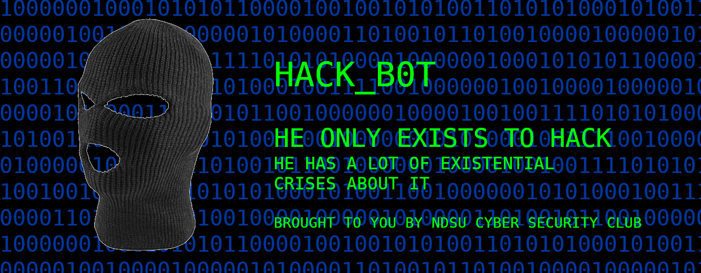

# HACK-B0T



### What is This?

Hack Bot is a [Slack](https://slack.com/) bot created for the NDSU Cyber Security Club Slack

### What Does it Do?

So far it only has basic chat commands, these commands are:

```
* anime ---- Image testing command
* ping ----- Pong!
* pong ----- Ping!
* purpose -- Learn hack-b0t's purpose
* yeehaw --- Yeehaw, partner, yeehaw.
* zimzam --- Oh I love Cowboy ZimZam!
* help ----- Displays a help page
* source --- Sends hack-b0t's Github repository
* blur ----- blur the most recent sent image by a given amount
* invert --- Inverts the colors of the most recent sent image
```

Which can be used by sending a command with a callsign in chat as follows:


### Future Plans

While Hack Bot currently contains any and all commands you could possibly want, there is still room for even more. Some furture ideas are:

* Server moderation tools
  * Ban and kick
  * Message purging
  * User interaction statistics
* Alias commands, for images and text
* Metasploit integration 
* Even more hacking power

### How Do I Add it to my Slack Server?

Why would you want that?

But on a more serious note, Hack Bot currently has not been built with multiple servers in mind. This may change in the future though, so stay tuned!

###### This project is licensed under the MIT Open Source License, see LICENSE for more information